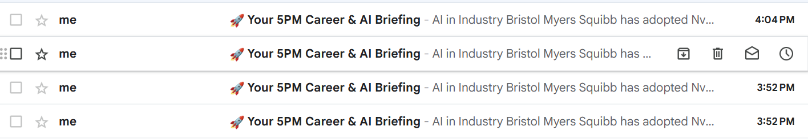
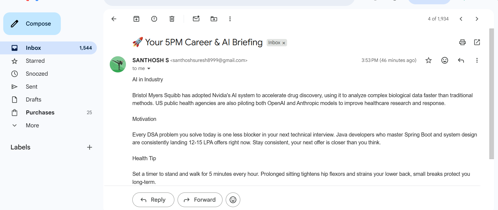

# 🚀 Career Compass — AI Career Briefing Automation


An AI-powered workflow built using **n8n**, **Claude AI**, **RSS Feed**, and **Gmail** that automatically delivers a personalized career briefing every day at **5:00 PM**.

The workflow keeps users updated with the latest AI industry news while also providing personalized career motivation and practical health tips.

---

# 📖 Project Overview

Career Compass is an intelligent workflow automation project designed to improve daily learning, career growth, and productivity.

Every day at **5:00 PM**, the workflow automatically:

- 📰 Fetches the latest AI industry news
- 📑 Selects the top 3 articles
- 🤖 Uses Claude AI to summarize the news
- 💼 Generates personalized career motivation
- 💪 Adds a practical daily health tip
- 📧 Sends everything directly to Gmail

This eliminates the need to manually search for AI news while ensuring users stay informed, motivated, and productive.

---

# ✨ Features

- ⏰ Daily 5 PM Automated Execution
- 📰 AI Industry News via RSS Feed
- 🤖 Claude AI Powered Summarization
- 💼 Personalized Career Motivation
- 💪 Daily Health Tip
- 📧 Automatic Gmail Delivery
- ⚡ Fully Automated using n8n
- 🔄 Modular Workflow Design

---

# 🛠️ Technology Stack

## Automation
- n8n

## Artificial Intelligence
- Claude AI (Anthropic)

## Data Source
- RSS Feed

## Email Service
- Gmail

---

# 🏗️ Workflow Architecture

```text
        Schedule Trigger (5:00 PM)
                  │
                  ▼
             RSS Feed
                  │
                  ▼
        Top 3 AI News Articles
                  │
                  ▼
             Claude AI
                  │
      ┌───────────┼────────────┐
      ▼           ▼            ▼
 AI News     Career Motivation  Health Tip
                  │
                  ▼
             Gmail API
                  │
                  ▼
                 User
```

---

# 📂 Repository Structure

```text
Career_Compass_AI_Career_Briefing_Automation
│
├── workflow/
│   └── Career_Compass_Workflow.json
│
├── images/
│   ├── workflow_canvas.png
│   ├── workflow_2.png
│   └── workflow_3.png
│
├── docs/
│   └── Project_Documentation.pdf
│
├── LICENSE
└── README.md
```

---

# ⚙️ Workflow

1. Schedule Trigger runs every day at **5:00 PM**.
2. RSS Feed fetches the latest AI industry news.
3. The **Limit** node selects the top **3 articles**.
4. Claude AI summarizes the selected articles.
5. Claude AI generates:
   - 📰 AI Industry Update
   - 💼 Career Motivation
   - 💪 Daily Health Tip
6. Gmail automatically sends the final briefing to the user.

---

# 📸 Project Screenshots

## Complete Workflow


---

## AI Agent Configuration



---

## Sample Email Output



---

# 📄 Documentation

The complete project documentation, workflow explanation, setup guide, and implementation details are available in:

```text
docs/Project_Documentation.pdf
```

---

# 🚀 Installation

## 1. Clone the Repository

```bash
git clone https://github.com/santhu1711/Career_Compass_AI_Career_Briefing_Automation.git
```

## 2. Install n8n

Download and install n8n from:

https://n8n.io/

## 3. Import the Workflow

Import the file:

```text
workflow/Career_Compass_Workflow.json
```

into your n8n workspace.

## 4. Configure Credentials

Configure the following credentials:

- Claude AI API
- Gmail OAuth
- RSS Feed URL

## 5. Activate the Workflow

Enable the workflow.

The automation will now execute automatically every day at **5:00 PM**.

---

# 🎯 Skills Demonstrated

- Workflow Automation
- AI Agent Integration
- Prompt Engineering
- RSS Feed Processing
- Gmail API Integration
- OAuth Authentication
- n8n Workflow Design
- Automation Scheduling
- AI Content Generation

---

# 🚀 Future Enhancements

- LinkedIn Job Recommendations
- Resume Improvement Suggestions
- AI Interview Questions
- Slack Integration
- Microsoft Teams Integration
- WhatsApp Notifications
- Google Calendar Integration
- Daily Coding Challenges
- Voice Assistant Support
- AI Career Roadmap Generator

---

# 📈 Project Outcome

- ✅ Automated daily AI career briefing
- ✅ Reduced manual effort
- ✅ Personalized AI-generated insights
- ✅ Improved awareness of AI industry trends
- ✅ Practical motivation and health guidance
- ✅ Demonstrated workflow automation using n8n and Claude AI

---

# 👨‍💻 Author

**Santhosh S.**

- GitHub: https://github.com/santhu1711
- LinkedIn: https://www.linkedin.com/in/santhosh17/

---

## ⭐ If you found this project useful, consider giving it a Star on GitHub!
